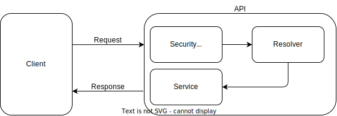

# Security

API security is crucial to protect data and ensure system integrity. Implementing adequate security measures, such as authentication, authorization and validation of information, helps prevent unauthorized access, security attacks, data manipulation and injections, which ensures the confidentiality and privacy of user information, thus building a solid foundation for reliable and secure applications and services.

## Validation

Accurate validation of information prior to processing is a crucial step in any application. The presence of incorrect or improperly formatted data can cause errors, expose security vulnerabilities and affect the proper functioning of the application. In this sense, our API implements validation techniques, using both Class-Validator and GraphQL-Scalars, to ensure the integrity and security of the data we process.

- [Class-Validator](./class-validator.md)
- [GraphQL-Scalar](./graphql-scalar.md)

## Roles

In our application, we have assigned different roles to users to ensure the security and functionality of the system. Each role offers a specific set of user privileges and responsibilities. 

- [Functionality](./../functionality/docs/functionality.md)